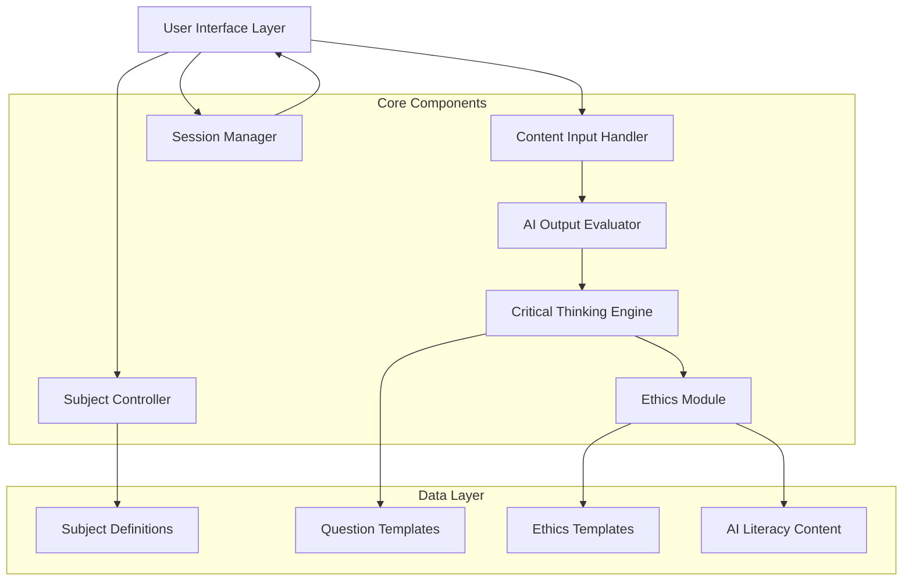

# Design Document: AI-powered Education Companion

## Overview

The AI-powered Education Companion is a web-based prototype that guides college students through critical evaluation of AI-generated content. The system emphasizes learning and skill development over answer provision, helping students develop AI literacy, critical thinking, and ethical judgment.

The prototype follows a guided workflow: subject selection → content input → analysis and evaluation → critical thinking prompts → ethical reflection → summary and next steps. Each screen is designed for clarity and educational impact, suitable for demonstration in academic or policy contexts.

## Architecture

The system uses a modular, component-based architecture optimized for a low-fidelity prototype:



**Key Architectural Principles:**
- **Modularity**: Each component handles a specific aspect of the evaluation process
- **Educational Focus**: All components prioritize learning over efficiency
- **Prototype Simplicity**: Designed for demonstration and validation, not production scale
- **Clear Data Flow**: Linear progression through evaluation stages with clear handoffs

## Components and Interfaces

### Subject Controller
**Purpose**: Manages subject selection and contextual configuration

**Interface**:
```typescript
interface SubjectController {
  getAvailableSubjects(): Subject[]
  selectSubject(subjectId: string): SubjectContext
  getSubjectContext(): SubjectContext
}

interface Subject {
  id: string
  name: string
  description: string
  evaluationCriteria: string[]
}

interface SubjectContext {
  subject: Subject
  focusAreas: string[]
  commonPitfalls: string[]
}
```

**Key Responsibilities**:
- Present subject options (Economics, Science, Social Studies)
- Configure evaluation criteria based on academic domain
- Maintain subject context throughout session

### Content Input Handler
**Purpose**: Manages AI-generated content input and validation

**Interface**:
```typescript
interface ContentInputHandler {
  validateInput(content: string): ValidationResult
  processContent(content: string): ProcessedContent
  getInputConstraints(): InputConstraints
}

interface ValidationResult {
  isValid: boolean
  errors: string[]
  warnings: string[]
}

interface ProcessedContent {
  originalText: string
  wordCount: number
  sentences: string[]
  timestamp: Date
}
```

**Key Responsibilities**:
- Accept and validate text input (up to 5000 characters)
- Provide clear feedback on input requirements
- Prepare content for analysis pipeline

### AI Output Evaluator
**Purpose**: Analyzes AI-generated content for potential issues and learning opportunities

**Interface**:
```typescript
interface AIOutputEvaluator {
  analyzeContent(content: ProcessedContent, context: SubjectContext): AnalysisResult
  identifyRisks(content: ProcessedContent): Risk[]
  assessReasoning(content: ProcessedContent): ReasoningAssessment
}

interface AnalysisResult {
  risks: Risk[]
  reasoningIssues: ReasoningIssue[]
  missingContext: ContextGap[]
  overallAssessment: string
}

interface Risk {
  type: 'factual' | 'bias' | 'oversimplification'
  location: TextSpan
  description: string
  severity: 'low' | 'medium' | 'high'
}
```

**Key Responsibilities**:
- Identify potential factual risks and inaccuracies
- Detect shallow reasoning and unsupported claims
- Flag missing context and important omissions
- Present findings as learning opportunities

### Critical Thinking Engine
**Purpose**: Generates targeted questions to develop student reasoning skills

**Interface**:
```typescript
interface CriticalThinkingEngine {
  generateQuestions(analysis: AnalysisResult, context: SubjectContext): Question[]
  getAssumptionQuestions(content: ProcessedContent): Question[]
  getDefenseQuestions(content: ProcessedContent): Question[]
}

interface Question {
  id: string
  text: string
  type: 'assumption' | 'evidence' | 'defense' | 'alternative'
  relatedRisk?: Risk
  followUp?: string
}
```

**Key Responsibilities**:
- Generate questions about assumptions in AI responses
- Prompt identification of misleading or incomplete information
- Create debate-style defense scenarios
- Sequence questions for maximum learning impact

### Ethics Module
**Purpose**: Guides ethical reflection on AI usage in academic contexts

**Interface**:
```typescript
interface EthicsModule {
  generateEthicalPrompts(context: SubjectContext): EthicalPrompt[]
  assessUsageAppropriateness(context: SubjectContext): UsageGuidance
  getDisclosureGuidance(): DisclosureGuidance
}

interface EthicalPrompt {
  question: string
  context: string
  considerations: string[]
}

interface UsageGuidance {
  isAppropriate: boolean
  reasoning: string
  alternatives: string[]
}
```

**Key Responsibilities**:
- Prompt consideration of AI usage appropriateness
- Encourage transparency and disclosure
- Provide guidance on academic integrity
- Frame ethical considerations in educational context

### Session Manager
**Purpose**: Orchestrates the overall user flow and maintains session state

**Interface**:
```typescript
interface SessionManager {
  startSession(): SessionId
  getCurrentStep(): WorkflowStep
  advanceToNextStep(): void
  getSessionData(): SessionData
  completeSession(): SessionSummary
}

interface SessionData {
  sessionId: string
  subject: Subject
  content: ProcessedContent
  analysis: AnalysisResult
  responses: UserResponse[]
  startTime: Date
}
```

**Key Responsibilities**:
- Manage workflow progression through evaluation steps
- Maintain session state and prevent data loss
- Coordinate between components
- Generate session summaries

### Voice Input Controller
**Purpose**: Manages voice recording, speech-to-text transcription, and multilingual support for content input

**Interface**:
```typescript
interface VoiceInputController {
  initialize(language: SupportedLanguage): boolean
  startRecording(): Promise<void>
  stopRecording(): void
  cancelRecording(): void
  setLanguage(language: SupportedLanguage): void
  isSupported(): boolean
  requestPermission(): Promise<PermissionState>
  getState(): VoiceInputState
}

interface VoiceInputState {
  isRecording: boolean
  isProcessing: boolean
  error: VoiceInputError | null
  transcript: string
  interimTranscript: string
  recordingDuration: number
  permissionState: PermissionState
}

type SupportedLanguage = 'en-IN' | 'hi-IN' | 'hinglish'
type PermissionState = 'granted' | 'denied' | 'prompt' | 'unknown'
```

**Key Responsibilities**:
- Initialize and configure Web Speech API with selected language
- Manage recording lifecycle (start, stop, cancel)
- Handle microphone permissions and browser compatibility
- Process recognition results (interim and final transcriptions)
- Track recording duration and enforce 60-second limit
- Manage error states and retry logic for network failures
- Ensure privacy by discarding audio after transcription

**Technology**: Uses browser-native Web Speech API (SpeechRecognition interface) with support for Chrome, Edge, and Safari. Gracefully degrades to text-only input in unsupported browsers.

## Data Models

### Core Data Structures

```typescript
// Subject and Context Models
interface Subject {
  id: string
  name: string
  description: string
  evaluationCriteria: string[]
  commonPitfalls: string[]
}

// Content Analysis Models
interface TextSpan {
  start: number
  end: number
  text: string
}

interface Risk {
  type: 'factual' | 'bias' | 'oversimplification' | 'unsupported_claim'
  location: TextSpan
  description: string
  severity: 'low' | 'medium' | 'high'
  learningNote: string
}

interface ReasoningIssue {
  type: 'shallow' | 'circular' | 'missing_evidence' | 'false_dichotomy'
  location: TextSpan
  explanation: string
  improvementSuggestion: string
}

// Question and Response Models
interface Question {
  id: string
  text: string
  type: 'assumption' | 'evidence' | 'defense' | 'alternative' | 'ethical'
  relatedRisk?: string
  followUp?: string
  aiLiteracyTip?: string
}

interface UserResponse {
  questionId: string
  response: string
  timestamp: Date
  reflection: string
}

// Session Models
interface SessionSummary {
  sessionId: string
  subject: string
  contentLength: number
  risksIdentified: number
  questionsAnswered: number
  keyLearnings: string[]
  nextSteps: string[]
}

// Voice Input Models
interface VoiceInputError {
  type: 'permission-denied' | 'network-error' | 'not-supported' | 
        'no-speech' | 'audio-capture' | 'aborted' | 'unknown'
  message: string
  recoverable: boolean
}

interface VoiceInputConfig {
  language: SupportedLanguage
  continuous: boolean
  interimResults: boolean
  maxAlternatives: number
  maxRecordingDuration: number // in seconds
}

interface RecognitionResult {
  transcript: string
  confidence: number
  isFinal: boolean
}

const LANGUAGE_CONFIG: Record<SupportedLanguage, {
  code: string
  displayName: string
  continuous: boolean
  description: string
}> = {
  'en-IN': {
    code: 'en-IN',
    displayName: 'English',
    continuous: true,
    description: 'Indian English accent'
  },
  'hi-IN': {
    code: 'hi-IN',
    displayName: 'हिंदी (Hindi)',
    continuous: true,
    description: 'Hindi language'
  },
  'hinglish': {
    code: 'en-IN',
    displayName: 'Hinglish',
    continuous: true,
    description: 'Mixed Hindi-English'
  }
}
```

### Static Data Configuration

**Subject Definitions**:
- Economics: Focus on data interpretation, economic reasoning, policy implications
- Science: Emphasis on evidence, methodology, peer review, reproducibility
- Social Studies: Attention to bias, multiple perspectives, historical context, source credibility

**Question Templates**: Pre-defined question patterns that can be customized based on content analysis

**AI Literacy Content**: Explanations of hallucinations, bias, training data limitations, appropriate use cases

## User Interface Design

### Screen Flow and Wireframe Descriptions

**Screen 1: Welcome and Subject Selection**
```
┌─────────────────────────────────────────┐
│ AI Education Companion                   │
│                                         │
│ Select your subject area:               │
│                                         │
│ ┌─────────────┐ ┌─────────────┐        │
│ │ Economics   │ │ Science     │        │
│ │ Policy &    │ │ Research &  │        │
│ │ Data        │ │ Evidence    │        │
│ └─────────────┘ └─────────────┘        │
│                                         │
│ ┌─────────────┐                        │
│ │ Social      │                        │
│ │ Studies     │                        │
│ │ Context &   │                        │
│ │ Perspective │                        │
│ └─────────────┘                        │
│                                         │
│           [Continue →]                  │
└─────────────────────────────────────────┘
```

**Screen 2: Content Input**
```
┌─────────────────────────────────────────┐
│ Economics Analysis                       │
│                                         │
│ Paste or speak the AI-generated         │
│ response you want to evaluate:          │
│                                         │
│ Language: [English ▼]                   │
│                                         │
│ ┌─────────────────────────────────────┐ │
│ │                                     │ │
│ │ [Large text input area]             │ │
│ │                                     │ │
│ │                                     │ │
│ │                                     │ │
│ └─────────────────────────────────────┘ │
│   [🎤 Microphone]  0/5000 characters    │
│                                         │
│ 📝 Tip: Include the full response for   │
│    better analysis                      │
│ 🔒 Audio is not stored after            │
│    transcription                        │
│                                         │
│ [← Back]              [Analyze →]       │
└─────────────────────────────────────────┘
```

**Screen 3: Analysis Results**
```
┌─────────────────────────────────────────┐
│ Analysis Results                         │
│                                         │
│ Your AI response analysis:              │
│                                         │
│ ⚠️  Potential Issues Found:             │
│                                         │
│ 🔍 Factual Risk (Medium)                │
│ "GDP growth of 15%" - This seems        │
│ unusually high for developed economies  │
│                                         │
│ 🤔 Missing Context (High)               │
│ No mention of inflation impact on       │
│ real vs nominal growth                  │
│                                         │
│ 💡 AI Literacy Tip:                     │
│ AI can generate plausible-sounding      │
│ statistics that may not reflect reality │
│                                         │
│              [Continue →]               │
└─────────────────────────────────────────┘
```

**Screen 4: Critical Thinking Questions**
```
┌─────────────────────────────────────────┐
│ Think Deeper                            │
│                                         │
│ Question 1 of 3:                        │
│                                         │
│ What assumptions does this response     │
│ make about economic conditions?         │
│                                         │
│ ┌─────────────────────────────────────┐ │
│ │ [Text input for student response]   │ │
│ └─────────────────────────────────────┘ │
│                                         │
│ 💭 Consider: What baseline conditions   │
│    are assumed? What context is missing?│
│                                         │
│ [← Previous]          [Next Question →] │
└─────────────────────────────────────────┘
```

**Screen 5: Ethical Reflection**
```
┌─────────────────────────────────────────┐
│ Ethical Considerations                   │
│                                         │
│ Before using this AI response:          │
│                                         │
│ ❓ Is using AI appropriate for this     │
│    assignment or context?               │
│                                         │
│ ○ Yes, with proper disclosure           │
│ ○ Yes, but needs significant revision   │
│ ○ No, original work required            │
│ ○ Unsure, need to check guidelines      │
│                                         │
│ 📋 Remember: Academic integrity         │
│    requires transparency about AI use   │
│                                         │
│ [← Back]              [Complete →]      │
└─────────────────────────────────────────┘
```

**Screen 6: Session Summary**
```
┌─────────────────────────────────────────┐
│ Learning Summary                         │
│                                         │
│ Great work! You've developed:           │
│                                         │
│ ✅ Identified 2 potential factual risks │
│ ✅ Recognized missing economic context  │
│ ✅ Considered ethical implications      │
│                                         │
│ 🎯 Key Takeaway:                        │
│ Always verify AI-generated statistics   │
│ and consider broader economic context   │
│                                         │
│ Next Steps:                             │
│ • Research the specific claims          │
│ • Consult authoritative sources         │
│ • Document your AI usage                │
│                                         │
│ [New Analysis] [Download Summary] [Exit]│
└─────────────────────────────────────────┘
```

### UI Copy Guidelines

**Tone**: Encouraging, educational, non-judgmental
**Language Level**: College-appropriate, clear and concise
**Action Labels**: Descriptive and specific ("Analyze Content" vs "Submit")
**Error Messages**: Constructive and helpful
**Success Messages**: Celebrate learning achievements

## Correctness Properties

*A property is a characteristic or behavior that should hold true across all valid executions of a system—essentially, a formal statement about what the system should do. Properties serve as the bridge between human-readable specifications and machine-verifiable correctness guarantees.*

Before defining the correctness properties, let me analyze the acceptance criteria to determine which are testable:

<function_calls>
<invoke name="prework">
<parameter name="featureName">ai-education-companion

Based on the prework analysis, I'll convert the testable acceptance criteria into correctness properties:

**Property 1: Subject Configuration Consistency**
*For any* valid subject selection, the system should configure appropriate evaluation criteria and maintain that subject context throughout the entire evaluation session
**Validates: Requirements 1.2, 1.4**

**Property 2: Input Validation and Processing**
*For any* text input within the valid length range (1-5000 characters), the system should accept and process the content, while rejecting empty or invalid inputs with appropriate error messages
**Validates: Requirements 2.2, 2.4**

**Property 3: Workflow Progression Integrity**
*For any* completed step in the evaluation process, the system should automatically advance to the next appropriate step in the sequence (subject selection → content input → analysis → questions → ethics → summary)
**Validates: Requirements 1.3, 2.5, 8.1, 8.2**

**Property 4: Analysis Completeness**
*For any* submitted AI-generated content, the analysis should identify and highlight potential factual risks, shallow reasoning, and missing context, presenting findings as learning opportunities
**Validates: Requirements 3.1, 3.2, 3.3, 3.4, 3.5**

**Property 5: Question Generation Completeness**
*For any* completed content analysis, the critical thinking engine should generate questions covering assumptions, misleading information identification, and debate defense scenarios
**Validates: Requirements 4.1, 4.2, 4.3, 4.4, 4.5**

**Property 6: Contextual Education Delivery**
*For any* evaluation session, the system should provide relevant AI literacy tips, explanations of AI concepts, and targeted educational content based on identified issues
**Validates: Requirements 5.1, 5.2, 5.3, 5.4, 5.5**

**Property 7: Ethical Guidance Consistency**
*For any* evaluation session, the ethics module should prompt consideration of AI usage appropriateness, encourage disclosure, and provide guidance on academic integrity
**Validates: Requirements 6.1, 6.2, 6.3, 6.4, 6.5**

**Property 8: UI Consistency and Usability**
*For any* screen in the application, the interface should provide clear action labels, progress indicators, consistent visual design, and student-friendly language appropriate for college users
**Validates: Requirements 7.1, 7.2, 7.3, 7.4, 7.5**

**Property 9: Session Management Integrity**
*For any* active evaluation session, the system should maintain session state, allow navigation between steps, and provide appropriate completion options without data loss
**Validates: Requirements 8.3, 8.4, 8.5**

### Voice Input Properties

**Property 10: Voice Recording State Transitions**
*For any* voice input system in idle state, when the microphone button is clicked, the system should transition to recording state; and for any recording state, clicking should transition to processing state
**Validates: Requirements 9.2, 9.3**

**Property 11: Language Configuration Persistence**
*For any* selected language (English, Hindi, or Hinglish), the selection should persist throughout the current session and be correctly applied to the speech recognition service
**Validates: Requirements 9.6, 9.7, 9.8**

**Property 12: Transcription Text Integration**
*For any* transcription result, the text should be correctly inserted into the input field, appended to existing text with appropriate spacing, with cursor positioned at the end, and validation triggered
**Validates: Requirements 9.13, 9.14, 9.15, 9.16, 9.17**

**Property 13: Recording Duration Management**
*For any* recording session, the displayed elapsed time should accurately reflect the time since recording started, and recording should automatically stop at 60 seconds
**Validates: Requirements 9.31, 9.32, 9.33, 9.34**

**Property 14: Multiple Recording Sessions**
*For any* sequence of recording sessions, each completed transcription should append to existing content, allowing students to build longer content through multiple recordings
**Validates: Requirements 9.35**

**Property 15: Browser Compatibility Detection**
*For any* browser environment, the system should correctly detect Web Speech API support and either display voice input UI or gracefully degrade to text-only input
**Validates: Requirements 9.27, 9.28, 9.30**

## Error Handling

The system implements comprehensive error handling to maintain educational focus even when issues occur:

### Input Validation Errors
- **Empty Content**: Friendly prompt to provide substantial content for meaningful analysis
- **Oversized Content**: Clear message about character limits with suggestion to summarize
- **Invalid Characters**: Graceful handling of special characters with preservation of educational intent

### Analysis Errors
- **Content Processing Failures**: Fallback to basic analysis with educational explanation of limitations
- **Risk Detection Issues**: Transparent communication about analysis limitations while maintaining learning focus
- **Question Generation Problems**: Default to core critical thinking questions if customized generation fails

### Session Management Errors
- **State Loss**: Automatic recovery with option to restart or continue from last stable point
- **Navigation Issues**: Clear error messages with alternative navigation paths
- **Timeout Handling**: Graceful session extension or restart options

### Educational Error Framing
All errors are presented as learning opportunities rather than system failures, maintaining the educational mission while providing clear resolution paths.

### Voice Input Errors
- **Permission Denied**: Clear explanation of microphone access requirement with browser-specific instructions
- **Network Failures**: Retry mechanism (up to 3 attempts) with fallback to text input suggestion
- **Browser Not Supported**: Informational message suggesting compatible browsers with seamless text input fallback
- **No Speech Detected**: Gentle reminder to speak clearly with immediate retry option
- **Recording Timeout**: Automatic stop at 60 seconds with warning at 55 seconds
- **Audio Capture Issues**: Helpful troubleshooting guidance with microphone connection checks

All voice input errors maintain the educational focus while providing clear paths to continue the evaluation process.

## Testing Strategy

The AI Education Companion requires a dual testing approach that balances comprehensive coverage with educational effectiveness validation:

### Property-Based Testing
Property-based tests will validate universal behaviors across all inputs using a minimum of 100 iterations per test. Each test will be tagged with its corresponding design property for traceability.

**Core Property Tests**:
- **Subject Configuration**: Generate random subject selections and verify consistent context maintenance
- **Input Processing**: Test with various content lengths and formats to ensure proper validation
- **Workflow Integrity**: Verify step progression works correctly regardless of content or subject
- **Analysis Completeness**: Test analysis functions with diverse AI-generated content samples
- **Question Generation**: Ensure complete question sets are generated for any analysis results
- **Educational Content**: Verify appropriate AI literacy content is provided in all contexts
- **UI Consistency**: Test interface elements across all screens and user interactions
- **Session Management**: Verify session integrity under various navigation and interaction patterns
- **Voice Input State Transitions**: Test recording state changes with various user interactions
- **Language Configuration**: Verify language persistence and correct application to speech recognition
- **Transcription Integration**: Test text insertion, appending, cursor positioning with random transcriptions
- **Recording Duration**: Verify time tracking and automatic stop behavior
- **Multiple Recordings**: Test content building through sequential recording sessions

### Unit Testing
Unit tests will focus on specific examples, edge cases, and integration points that demonstrate correct educational behavior:

**Component-Specific Tests**:
- Subject Controller: Test specific subject configurations and context switching
- Content Input Handler: Test boundary conditions (exactly 5000 characters, empty input, special characters)
- AI Output Evaluator: Test with known problematic content samples to verify risk detection
- Critical Thinking Engine: Test question generation with specific analysis scenarios
- Ethics Module: Test ethical guidance with various academic contexts
- Session Manager: Test specific workflow transitions and error recovery scenarios
- Voice Input Controller: Test Web Speech API integration, permission handling, error scenarios
- Voice Input Button: Test rendering states, keyboard accessibility, ARIA attributes
- Language Selector: Test language options, selection persistence, disabled states

**Integration Tests**:
- End-to-end workflow completion with sample content
- Cross-component data flow validation
- Error handling across component boundaries
- Educational effectiveness with realistic user scenarios

**Testing Configuration**:
- Property tests: Minimum 100 iterations using appropriate PBT library for chosen implementation language
- Unit tests: Focus on educational effectiveness and user experience validation
- Integration tests: Validate complete learning workflows
- All tests tagged with format: **Feature: ai-education-companion, Property {number}: {property_text}**

The testing strategy emphasizes educational outcomes over technical performance, ensuring the prototype effectively demonstrates its learning objectives while maintaining system reliability.